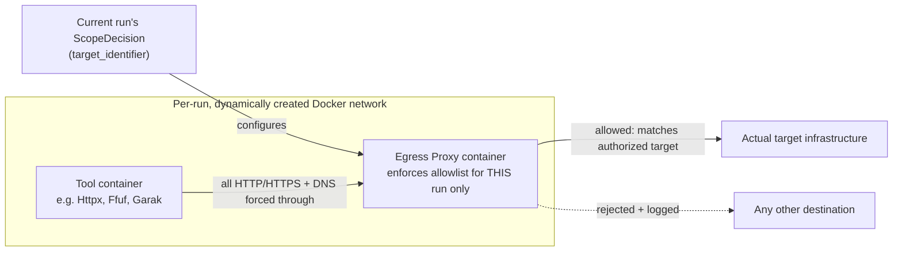

# 07_DOCKER_SPEC/README.md
## Hypermind — Track A — Docker Execution Specification

**Document:** STEP 07 of 15 · Track A Documentation Package
**Status:** Implementation-ready container security specification
**Depends on:** `01_ARCHITECTURE.md` §17, §19.4 (isolation principle), `02_COMPONENT_SPECS.md` §12 (Docker Tool Execution Engine — the component this spec configures), `03_DATA_SCHEMAS/README.md` §2.4–2.7 (ToolManifest/ToolExecutionRequest/Result/RawToolOutput — the data this execution model produces), `06_TOOL_REGISTRY/` (per-tool resource/network/filesystem values this document enforces)
**Resolves (proposed):** OD-18 (network scoping mechanism), OD-13 (output capture truncation limit) — both remain formally open pending Harsh's sign-off; concrete recommendations are given here for the first time

---

## How to Read This Document

This does not re-explain why tools are isolated (`01` §17) or what the Docker Tool Execution Engine's responsibilities are (`02` §12) — it defines **how** those responsibilities are technically satisfied. It does not repeat any tool's specific numbers (CPU/memory/timeout values) — those are `06`'s per-tool `ToolManifest` entries; this document defines the *mechanism* that enforces whatever number a manifest specifies, generically, for every tool.

**Guiding principle, stated once:** untrusted tools never run on the host, in any form — not the binary, not a chroot, not a bare process. Every mechanism below exists in service of that one rule (`01` §4, §17).

Label legend unchanged — **[LOCKED] [REQ] [REC] [ASSUMPTION] [OPEN — REQUIRES HARSH] [FUTURE] [INFERENCE]**.

---

## §1 — Image Provisioning & Verification

**[REQ]** No tool container is ever built or pulled fresh at pipeline-run time. Images are provisioned during a separate, human-supervised **provisioning phase**, and only a verified, pinned digest is ever referenced at run time. This closes the `<PINNED_DIGEST_REQUIRED>` placeholder used throughout `06`.

**Provisioning workflow [REC]:**
1. A human (not the pipeline) pulls the intended image at a chosen version tag from its upstream source.
2. The resulting content digest (`sha256:...`) is recorded and written into that tool's `ToolManifest.container_image` field in `06`.
3. Before the pipeline ever uses that tool, the Docker Tool Execution Engine verifies the locally-cached image's digest matches the manifest's recorded digest — **exact match required, not "same tag."**
4. Any mismatch (the upstream image changed without a corresponding manifest update) **halts that tool's availability** and requires a human to review the change and re-pin deliberately. This is a fail-closed supply-chain control, consistent with the Policy Engine's fail-closed principle (`02` §6) — an unexpected image change is treated the same as an unauthorized policy change: something a human must explicitly approve, never something the pipeline silently accepts.

**[OPEN — REQUIRES HARSH] OD-20.** Should image verification also include cryptographic signature verification (e.g. `cosign`) where an upstream project publishes signed images, beyond digest pinning alone? This adds real assurance (a compromised registry couldn't silently swap a digest without also forging a signature) but also real operational cost (deciding which upstream signing keys to trust, and maintaining that trust store). Not all eight tools in `06` necessarily publish signed images — this would need per-tool investigation. Recommend digest pinning as the **mandatory** baseline (§1 above) and signature verification as an **optional enhancement per tool**, added opportunistically where available, rather than a blocking MVP requirement.

---

## §2 — Resource Limit Enforcement

**[REQ]** Every container launch applies, at minimum, the following Docker-level constraints, using whatever numeric values the invoked tool's `ToolManifest.resource_limits` specifies (`06` gives the numbers; this section gives the mechanism):

| Constraint | Mechanism | Notes |
|---|---|---|
| CPU | `--cpus="<value>"` at container launch | Hard ceiling, not a scheduling hint |
| Memory | `--memory="<value>m"` **and** `--memory-swap="<same value>m"` | Setting swap equal to the memory limit disables swap use entirely — without this, a container could exceed its intended memory ceiling by swapping, defeating the limit **[REQ]** |
| PID limit | `--pids-limit=<value>` | Prevents fork-bomb-style resource exhaustion from a misbehaving or hostile tool process |

**[ASSUMPTION]** `06`'s manifests didn't always specify an explicit `pid_limit` value for every tool (some did). Where a manifest omits it, this document recommends a conservative default of `pid_limit: 64` unless the specific tool's manifest states otherwise — flagged as an assumption, not silently applied without note, since it's filling a gap `06` left implicit rather than resolving something `06` explicitly deferred.

---

## §3 — Timeout Enforcement

**[REQ]** Timeout is enforced **twice, independently** (belt-and-suspenders), because Docker itself has no native "kill after N seconds" flag — relying on a single enforcement point creates a single point of failure:

1. **External supervisor timeout** — the Docker Tool Execution Engine (`02` §12) starts a wall-clock timer when it launches a container and issues `docker stop` (graceful) followed by `docker kill` (forced, after a short grace period) if the tool's `timeout_seconds` is exceeded.
2. **In-container timeout** — the container's entrypoint is wrapped with the Unix `timeout` command (or equivalent) set to the same duration, so that if the external supervisor process itself hangs or crashes, the container still self-terminates rather than running indefinitely.

**[REC]** The in-container timeout should be set to the manifest's `timeout_seconds` value exactly; the external supervisor's timeout should be set slightly longer (e.g. +10 seconds) so the in-container mechanism is normally the one that fires first, with the external supervisor as the actual safety net for the case where the in-container mechanism itself fails.

---

## §4 — Network Policy (Proposed Resolution to OD-18)

`06`'s cross-cutting note left this genuinely unresolved: every active tool's manifest states an *intent* ("egress to target hosts only") with no described *mechanism*. This section proposes one.

**[REC, OD-18 remains formally OPEN pending confirmation]** Proposed mechanism: a **forced egress proxy**, not a static per-container allowlist.

**Why a forced proxy rather than a static allowlist written into each manifest:**
- A manifest's network policy is written once, at registration time, and describes a *tool*, not a *run*. But what's authorized changes per run — it's whatever the current `ScopeDecision.target_identifier` says (`03` §2.2). A static allowlist baked into the manifest can't reflect that; a per-run proxy configured fresh from the current `ScopeDecision` can.
- A proxy enforces the boundary **regardless of whether the tool itself cooperates.** Some tools respect `HTTP_PROXY`/`HTTPS_PROXY` environment variables voluntarily; not all do, and none should be trusted to. Recommend forcing traffic through the proxy at the network level — via `iptables` redirect rules on the per-run Docker network, or by giving the tool container no default route except through the proxy — so the boundary holds even against a tool that ignores or attempts to bypass proxy environment variables.
- **DNS is included, not an afterthought.** The proxy should also handle DNS resolution for the tool container (rather than the container reaching a public resolver directly), both to prevent DNS being used as an exfiltration channel and so every resolved hostname can be checked against the authorized target before the connection is even allowed to proceed.

**[REQ, if this mechanism is approved]** The per-run Docker network and its proxy container are created fresh for each run and torn down when the run completes — no network or proxy configuration persists or is reused across runs, which would risk one run's authorized scope leaking into a later run's traffic path.

**What this document does NOT decide:** the exact proxy implementation (a small custom forward-proxy vs. an existing tool like Squid/mitmproxy configured per-run) is left open as part of OD-18 — this section specifies the required *behavior* (forced routing, per-run scope, DNS included, reject-and-log by default), not a specific product choice.

---

## §5 — Filesystem Policy

**[REQ]** Every container launches with `--read-only` set on its root filesystem, matching `06`'s per-tool `filesystem_requirements.read_only_root: true` — this was already decided per-tool in `06`; this section is the mechanism.

**[REQ]** Where a tool genuinely needs writable scratch space (per `06`'s `scratch_space_mb` values), it is provided via an in-memory `tmpfs` mount (`--tmpfs /tmp:size=<X>m,mode=1777`), never a bind-mounted host directory. This guarantees no tool output can persist on host disk outside the explicit output-capture path (§7) — a `tmpfs` mount's contents vanish the moment the container is removed.

**[REQ]** No host directory is ever bind-mounted into a tool container. If a tool genuinely requires an input file it doesn't generate itself (e.g. Ffuf's wordlist, per `06` §4), that specific file — never a directory — is mounted read-only, and only that file.

---

## §6 — Secrets Handling

**[REQ]** No long-lived credential is ever baked into a tool container image.

**[ASSUMPTION]** None of the eight tools in `06` currently require an injected secret to operate at Phase 2A MVP scope. Subfinder, notably, *can* use third-party OSINT provider API keys (e.g. Shodan, SecurityTrails) to improve passive-recon coverage — this document assumes those are **not** configured for the MVP, accepting reduced passive-source coverage in exchange for zero secrets-management surface area. This is a reasonable default, not a silently-made permanent decision — flagged below as OD-21.

**[REQ, if any future tool does need a secret]** injection is via a short-lived environment variable scoped to that single container invocation, sourced from a proper secrets store rather than a shared plaintext config file, and — critically — that variable **must be excluded from any captured log output.** A secret that leaks into a tool's stdout/stderr (e.g. a tool that echoes its configuration on startup) and is then captured as part of `RawToolOutput` would be a serious violation, since `RawToolOutput` per `03` §2.7 is explicitly untrusted and its content is not treated with credential-grade confidentiality anywhere downstream. This is a hard requirement on any future secret-using tool's manifest, not merely a recommendation.

**[OPEN — REQUIRES HARSH] OD-21.** Should Subfinder (or any other tool) be configured with third-party OSINT provider API keys to improve recon coverage? Deferring this to a later decision keeps the MVP's secrets-management scope at zero, which is a meaningful simplicity win — but it does mean accepting weaker passive-recon results than the tools are capable of. Worth revisiting once real runs show whether passive-source coverage is actually a bottleneck.

---

## §7 — Logging & Output Capture

**[REQ]** Container stdout/stderr is captured **synchronously, while the container runs** — via a piped subprocess/SDK stream — not retrieved afterward via a separate `docker logs` call. This matters concretely: containers are launched with `--rm` (§8), which removes the container (and its log buffer) immediately on exit, so any capture attempted after the fact would simply fail to find anything.

**[LOCKED]** This synchronous capture point **is** Trust Boundary B physically (`01` §6) — the moment a tool's output is captured by the Docker Tool Execution Engine, it becomes a `RawToolOutput` record (`03` §2.7) with `trust_classification: RAW_OBSERVATION`. There is no intermediate "somewhat trusted" state between the container producing output and that output being marked untrusted.

**[REC, proposed resolution to OD-13]** Captured output is size-bounded to prevent an unexpected flood (whether malicious or just a misconfigured tool) from producing an unbounded `RawToolOutput` record. Recommend a **10 MB cap per single tool execution** — output beyond this is truncated, and `RawToolOutput.truncated` (`03` §2.7) is set to `true`. This is a starting recommendation, not a value derived from any load-testing; OD-13 remains formally open until Harsh confirms this number (or a different one) is appropriate given real tool behavior.

---

## §8 — Cleanup

**[REQ]** Every container is launched with `--rm` (or the SDK equivalent), so it is removed immediately on exit — no stopped containers accumulate on the host across runs.

**[REQ, if §4's network proposal is adopted]** the per-run Docker network and its egress proxy container are torn down when the run completes, for the same reason — no per-run network state should persist or be reusable by a later run.

**[REC]** As a safety net for the case where `--rm` fails to fire (e.g. a Docker daemon crash mid-run), recommend a periodic host-level reconciliation job (e.g. a daily `docker system prune` equivalent, scoped to avoid removing anything unrelated to Track A) rather than relying on `--rm` alone to guarantee a clean host state indefinitely. Exact cadence is an operational tuning detail, not something this document needs to lock.

---

## Future Hardening Note (Not Blocking MVP)

**[FUTURE]** Standard Docker containers share the host kernel — a sufficiently severe container-escape vulnerability could, in principle, reach the host despite every control in this document. Stronger sandboxing technologies (e.g. gVisor, Kata Containers, Firecracker microVMs) provide a harder isolation boundary by not sharing the host kernel at all. This is a legitimate defense-in-depth upgrade path worth considering **after** the MVP is running and stable — not something this document treats as a blocking requirement now, since `01`/`02`/`06` have already locked "isolated Docker containers" as the chosen technology, and revisiting that choice is a bigger decision than this document's scope.

---

## New Open Decisions Raised in This Document

| ID | Question | Raised in |
|---|---|---|
| **OD-20** | Should image verification include cryptographic signature verification (e.g. `cosign`) beyond digest pinning, where upstream images are signed? | §1 |
| **OD-21** | Should Subfinder (or other tools) be configured with third-party OSINT provider API keys to improve passive-recon coverage, accepting the resulting secrets-management scope? | §6 |

**Proposed resolutions given (not new OD numbers, existing items advanced):**
- **OD-18** (network scoping mechanism) — a concrete forced-egress-proxy design proposed in §4; remains open pending Harsh's confirmation of the mechanism and choice of underlying proxy implementation.
- **OD-13** (output truncation limit) — a concrete 10 MB recommendation given in §7; remains open pending confirmation.

Carried forward with OD-01 through OD-19 into `13_OPEN_DECISIONS.md`. Running total: **21 open decisions**, two of which (OD-13, OD-18) now have a concrete proposal attached rather than being entirely unaddressed.

---

## WHAT YOU SHOULD UNDERSTAND BEFORE NEXT

Before `08_MODEL_REGISTRY/`, these concepts matter most:

1. **A stated intent and an enforced mechanism are different things — this document exists because of that gap.** `06` said "egress to target hosts only" eight times; none of those statements enforced anything by themselves. Watch for this same gap pattern in `08`: a `ModelManifest` might state "primary/fallback status" or a "generation policy," but *what actually enforces* that a fallback model is used only when the primary fails, rather than arbitrarily, is a mechanism question `08` will need to answer the same way this document answered network scoping.

2. **Fail-closed on supply-chain integrity, not just on live decisions.** Sections 2 and 6 (fail-safe policy decisions, fail-safe scope decisions) established the "when in doubt, deny" pattern for *live* decisions. §1 of this document extends the same discipline to a *static* concern — an unexpected image change halts that tool rather than silently trusting whatever the registry now serves. The principle generalizes further than just runtime decision-making.

3. **Belt-and-suspenders enforcement (§3's dual timeout) is a deliberate pattern, not redundancy for its own sake.** Any single enforcement mechanism can fail in a way that specifically defeats that mechanism (a hung supervisor process can't kill anything). Look for other places in this package where a single point of enforcement might benefit from the same treatment — e.g., is there a case for double-checking the Evidence Gate's "replication_command must be non-empty" rule at more than one layer, given how load-bearing that single check is to the whole evidence-over-confidence principle?

4. **The proxy-based network design is a proposal you can push back on.** I gave a specific recommendation (forced proxy, DNS included, per-run teardown) because OD-18 needed something concrete to react to, not because it's the only reasonable design. If a simpler mechanism turns out to be sufficient for the MVP's actual risk level (e.g. static iptables rules generated per-run without a full proxy container), that's a legitimate alternative — the requirement this document actually locks is the *behavior* (dynamic, per-run, DNS-inclusive, fail-closed), not the specific proxy architecture.

5. **Two open decisions (OD-13, OD-18) now have a concrete number/design attached instead of sitting as bare questions.** This is worth noticing as a documentation pattern: an open decision doesn't have to stay abstract forever before `13_OPEN_DECISIONS.md` — giving a recommendation attached to an open item makes it much faster for Harsh to simply confirm or override, versus starting from nothing.
