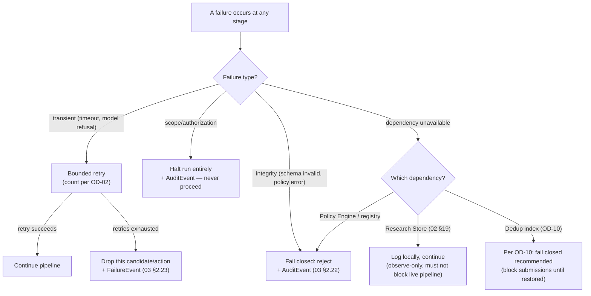

# 09_SECURITY_POLICIES/README.md
## Hypermind — Track A — Security Policies

**Document:** STEP 09 of 15 · Track A Documentation Package
**Status:** Authoritative security policy layer
**Depends on:** `01_ARCHITECTURE.md` §4, §6, §15, §17 (principles, trust boundaries, human-control boundaries, isolation), `02_COMPONENT_SPECS.md` (component-level security constraints these policies govern), `06`/`07` (tool + container mechanisms these policies configure)
**Is the authoritative resolution for:** the redaction policy deferred here by `04` (Worker manifests) and `06` (audit_requirements); the fail-closed rules stated piecemeal across `02`/`06`/`07`; the audit-logging requirements scattered as per-component Observability rows in `02`

---

## How to Read This Document

This is the **policy authority**. Where earlier documents said "per audit policy in `09_SECURITY_POLICIES/`" or "fail closed" or "this is a security boundary," this document is what those pointers resolve to. It does **not** re-explain what a trust boundary *is* (`01` §6), how Docker isolation *works* (`07`), or what a component *does* (`02`) — it states the **enforceable rules** that govern them, in one place, so no security rule lives only as a scattered aside.

**The governing principle, restated once as the frame for everything below:** MODEL PROPOSES → POLICY DECIDES → HUMAN VALIDATES (`01` §4). Every policy here serves one of those three clauses.

Label legend unchanged — **[LOCKED] [REQ] [REC] [ASSUMPTION] [OPEN — REQUIRES HARSH] [FUTURE] [INFERENCE]**.

---

# §1 — Scope Policy (the "authorized target" rule)

**[LOCKED]** No tool touches any target that is not authorized for the current run. This is the single most consequential policy in Track A — a violation has legal and ethical consequences, not merely technical ones (`02` §7).

**Policy structure [REC] — expressed as the shape of a Rego policy, not a final implementation:**

```rego
# scope.rego — illustrative structure, not final code
package hypermind.trackA.scope

# default deny — the foundational posture (01 §4 fail-safe)
default allow = false

allow {
    input.target_identifier != ""
    some pattern in data.authorized_scope_patterns
    target_matches(input.target_identifier, pattern)
    input.authorization_reference != ""   # a pointer to proof must exist
    not out_of_scope_override(input.target_identifier)
}

# explicit exclusions win over inclusions — an out-of-scope
# subdomain inside an in-scope wildcard is still denied
out_of_scope_override(target) {
    some excluded in data.explicitly_excluded
    target_matches(target, excluded)
}
```

**[LOCKED]** Three properties this policy must have, regardless of final implementation:
1. **Default-deny.** Absence of a matching authorization = deny, never "allow because nothing said no" (`01` §4).
2. **Exclusions override inclusions.** A bounty program's in-scope wildcard (`*.example.com`) frequently carries explicit carve-outs (`admin.example.com` out of scope). An excluded target inside an included wildcard must resolve to **deny**. This is a common real-world scope shape and a common real-world violation — worth being explicit about.
3. **Ambiguity resolves to deny** (`02` §7) — if `target_matches` cannot confidently decide, the answer is deny, not a best guess.

**[OPEN — REQUIRES HARSH] OD-23.** The `authorization_reference` field (`03` §2.1) currently only has to *be present and non-empty* — the policy checks that a pointer to proof exists, not that the proof is *valid*. Validating that the reference actually corresponds to a live, current authorization (e.g. fetching and parsing a bounty program's scope page) is a much harder problem and introduces its own trust question (the scope page itself is fetched content). This document does not decide whether the MVP attempts reference *validation* or only reference *presence* — presence-only is the simpler, safer-to-build starting point, but it leans harder on the human (§5) to have confirmed real authorization. Flagged rather than silently assumed.

---

# §2 — Trust Boundary Policy (TB-A and TB-B)

TB-A and TB-B are defined architecturally in `01` §6 and their mechanisms live in `02` §8 (TB-A input guard) and `07` §7 (TB-B = the output-capture point). This section states the **policy rules** governing them, not the mechanisms.

**[LOCKED] TB-A policy:** all input reaching the Orchestrator's planning LLM is screened first (`02` §8). A screening rejection is terminal for that input — there is no "screen again with the suspicious part removed" retry, because a partial injection is still an injection.

**[LOCKED] TB-B policy — the single most important data-handling rule in Track A:** any content produced by, returned from, or influenced by a target is `RAW_OBSERVATION` (`03` §2.7) and is **data, never instructions**, at every point downstream, forever. No component — not the Extractor, not a Worker, not the Judge, not the Specialist — may treat any string originating past TB-B as a directive to act on. This is enforced structurally at the Extractor (`02` §13) and reinforced as a defense-in-depth `must_not` on every Worker (`04` C6).

**PromptGuard [REC, per `01` §6 "where specified"]:** PromptGuard-for-Agents sits at TB-A as a trust-boundary policy distinct from any component's own logic (`01` §6, and the earlier master architecture's §10). Its role is narrow: prevent target-controlled or externally-sourced content from being elevated into trusted instructions. It is **not** part of the Judge's or any Specialist's reasoning — it is a boundary guard, and keeping it architecturally separate from component logic is itself the policy.

**[INFERENCE]** There is a subtle interaction between TB-A and TB-B worth naming: TB-A screens input *going into* planning; TB-B marks tool output *coming back*. A finding's evidence (which originated past TB-B as untrusted target data) eventually gets summarized into a `HumanReviewPackage` (`03` §2.20) that a human reads. The policy consequence: **the human-review interface must render untrusted evidence content inertly** (as displayed text, never as anything the interface itself interprets or executes) — otherwise TB-B's guarantee could be undone at the very last step by a review UI that, say, renders attacker-controlled HTML. This is a real policy requirement that the eventual resolution of OD-06 (the human-verification interface mechanism) must honor.

---

# §3 — Authorization Policy (the consolidated matrix)

Individual registries enforce their own lookups (`02` §1–4). This section consolidates **who may invoke or access what** into one authoritative matrix — previously this existed only as scattered per-component constraints.

| Actor | May invoke/access | May NOT invoke/access | Enforced by |
|---|---|---|---|
| Planning LLM (in Orchestrator) | Propose actions only | Execute anything directly | `02` §11 — proposals pass through deterministic checks |
| Orchestrator (deterministic) | Authorize tools/workers/specialists after checks | Authorize anything unregistered | `02` §11 check chain |
| Worker | Its own `allowed_tools` (currently `[]` for all, `04`) | The Skill Registry; any tool beyond its manifest | `02` §14 framework-level enforcement |
| **Judge** | `JudgeInput` (worker outputs + evidence) | **The Skill Registry — structurally unreachable** (`02` §3); offensive methodology | `02` §3 access control + `03` §2.13 `contains_skill_content: false` |
| Specialist | The Skill Registry; its Skill's declared `permissions` (`05`) | Tools directly; execution authority (`02` §16 — even its `replication_command` is a proposal) | Skill Registry access control + `02` §16 |
| Report Polisher | A validated finding only | Any pre-validation candidate; introducing new claims | `03` §2.21 (references a `submit` ValidationOutcome only) |
| Any live component | Write to the Research Store | Read from the Research Store during live execution | `02` §19 one-directional interface |

**[LOCKED]** The single most security-critical cell in this matrix is the Judge's row: the Judge cannot reach the Skill Registry, cannot receive offensive methodology, and every `JudgeInput` asserts `contains_skill_content: false`. This is the finder/judge separation (`01` §19.7) expressed as an authorization rule, enforced in three independent places (structural unreachability, schema assertion, and — per OD-22 from `08` — ideally model-family independence too).

---

# §4 — Data-Handling & Redaction Policy (the authority `04`/`06` deferred here)

`04` (Worker manifests) and `06` (tool audit_requirements) both deferred their redaction rules to this document. Here is the authoritative policy.

**[LOCKED] Credential-class data — never logged, never echoed, anywhere:**
- Full authentication tokens, session cookies, API keys, passwords, or bearer credentials — whether they appear in tool input, tool output, worker input, or any log or audit record.
- This applies with **no exception for debug or failure logs** — the moment a credential could appear in a stack trace or error dump is precisely when redaction matters most.
- The Auth Analyst worker (`04` §3) carries the strictest form of this because its entire input domain is auth-adjacent; this policy is what `04` §3's stricter note deferred to, and it confirms that stricter treatment is correct and now formally required, not merely `04`'s local inference.

**[REQ] Sensitive-but-not-credential data — redacted or summarized, not stored verbatim:**
- Live user data incidentally captured in `RawToolOutput` (e.g. an IDOR proof-of-concept response containing another user's real personal data). The evidence must demonstrate the vulnerability without persisting more real user data than necessary to prove it — a redacted/representative snippet, not a full dump. This directly supports the SSRF/IDOR skills' evidence requirements (`05`) while limiting the project's own exposure to handling third-party personal data.
- Wordlist-hit path names from Ffuf (`06` §4) that could themselves reveal sensitive internal structure — logged as counts/hashes where the literal value isn't needed.

**[LOCKED] Never redacted (must be preserved in full for the system to function):**
- Provenance fields (`03` §1.1) — model/tool IDs and versions, timestamps, stage. These are the audit backbone; redacting them would defeat traceability.
- `replication_command` (`03` §2.17) — the reproduction step must be preserved verbatim for the human and for research value, though it must be *written* so as not to embed a literal credential in the first place (`05`'s Auth Bypass skill already requires descriptive credential references rather than literal secrets).

**[INFERENCE]** There's a genuine tension between "evidence must prove the vulnerability" and "don't store third-party user data." The policy resolves it in favor of *minimal sufficient evidence* — enough to let a human confirm the finding, not a complete data exfiltration kept as a trophy. This tension is inherent to bug-bounty work generally, not unique to this project, but stating the resolution explicitly matters because the pipeline could otherwise quietly accumulate a large store of real victim data as a side effect of documenting findings.

---

# §5 — Human-Validation & Submission Controls

**[LOCKED]** Three human-control points (`01` §15), restated here as enforceable policy rather than architecture:

| Control point | Policy rule | Enforced by |
|---|---|---|
| Scope authorization (entry) | No run begins without a human-supplied `ScopeRequest` carrying an `authorization_reference` (§1) | `02` §7 |
| Verification (mid-late) | No candidate proceeds toward submission without an explicit human `ValidationOutcome` with `decision: submit`, `human_identity`, and timestamp (`03` §3.5). **No default, no timeout-based auto-decision** (`02` §18). | `03` §2.20/§3.5 + `02` §18 |
| Submission (exit) | The system produces a *report draft* only (`02` §17). The actual act of submitting to a bounty platform is performed by a human, outside the system. **The pipeline has no submission capability to a bounty platform, by design** (`01` §15). | Absence of any submission integration — enforced by omission, like the Judge/Skill separation |

**[LOCKED]** "Automatic submission is impossible" is enforced the strongest way possible: not by a policy that forbids it, but by the system simply **not containing** any mechanism to submit to a bounty platform at all. There is nothing to disable because there is nothing to begin with. This is the most robust form of a security guarantee — the capability's absence, not its restriction.

**[INFERENCE]** This has a consequence worth stating: even a fully compromised pipeline (every model jailbroken, every gate bypassed) still cannot auto-submit, because the submission action lives entirely in human hands outside the system. This is the deepest safety property in all of Track A, and it comes for free from a design choice, not from a control that could itself fail.

---

# §6 — Failure Escalation Ladder (consolidated)

`01` §14 listed per-stage failure behaviors; `02` gave per-component failure handling. This section consolidates them into one escalation ladder, so the *pattern* is visible in one place rather than distributed across twelve components.



**[LOCKED]** The escalation principle that unifies the ladder: **the more security-consequential the failure, the more it errs toward stopping.** A transient model refusal retries then drops (low consequence — just this candidate lost). A scope failure halts the entire run (highest consequence — potential unauthorized access). A schema/policy failure fails closed (integrity of the control chain). Only one failure type is permitted to *not* stop the pipeline — Research Store unavailability — precisely because that store is observe-only and blocking on it would let a non-security concern degrade live operation (`02` §19).

---

# §7 — Audit Logging Policy (consolidated from scattered Observability rows)

Every component in `02` had an Observability row. This section states the **policy** those rows collectively imply, so audit logging is a coherent requirement rather than twelve independent per-component habits.

**[LOCKED] Every security-relevant event is logged as an `AuditEvent` (`03` §2.22) or `FailureEvent` (`03` §2.23), with full provenance (`03` §1.1).** Security-relevant means, at minimum: every scope decision, every Orchestrator authorize/reject (with which of the five checks failed), every registry rejection, every Skill Registry access attempt (especially an unexpected caller — `02` §3), every human decision, and every gate pass/fail.

**[REQ] Logs are subject to §4's redaction policy in full.** An audit log that captured a credential in the name of "completeness" would violate §4 — auditability and redaction are not in tension here, because provenance (who/what/when) is never the sensitive part; the payload sometimes is, and the payload is what gets redacted.

**[OPEN — REQUIRES HARSH] OD-24.** Log retention period and storage security for audit/failure logs is unspecified. Bug-bounty work can involve sensitive target data even after §4 redaction (redaction reduces but never fully eliminates sensitivity), and audit logs are themselves a security asset an attacker would value (they map exactly what was tested and found). This document does not set a retention period or a log-encryption-at-rest requirement — both are real decisions with compliance and operational-security implications that need Harsh's explicit input, not a silently-chosen default.

---

# §8 — Secrets Policy

Fully specified mechanically in `07` §6 (no long-lived credentials in images; short-lived scoped env vars if ever needed; exclusion from captured output). The **policy** layer adds only this:

**[LOCKED]** Any future introduction of a secret-using tool (per OD-21, e.g. Subfinder OSINT keys) requires, before activation: (1) the secret sourced from a proper secrets store, not a config file; (2) the secret's exclusion from all logging verified against §4 and §7; (3) a recorded decision authorizing it. A secret must never enter the system as an undocumented convenience.

---

## New Open Decisions Raised in This Document

| ID | Question | Raised in |
|---|---|---|
| **OD-23** | Does the MVP validate that an `authorization_reference` corresponds to a live/current authorization, or only that it's present? Presence-only is simpler and safer to build but leans harder on the human. | §1 |
| **OD-24** | Audit/failure log retention period and encryption-at-rest requirements — unspecified, with real compliance and operational-security implications. | §7 |

**Advanced (not new): OD-06** (human-verification interface) now carries an additional policy constraint from §2 — whatever interface is chosen must render untrusted evidence content inertly, or it could undo TB-B's guarantee at the final step.

Carried forward with OD-01 through OD-22 into `13_OPEN_DECISIONS.md`. Running total: **24 open decisions.**

---

## WHAT YOU SHOULD UNDERSTAND BEFORE NEXT

Before `10_RESEARCH_DATA_PIPELINE.md`, these concepts matter most:

1. **The strongest security guarantee in Track A is an absence, not a control.** §5's insight is the most important idea in this document: "automatic submission is impossible" is guaranteed not by a rule that could be bypassed, but by the system containing no submission mechanism at all. When you read `10`, apply the same lens to the research layer — its safety comes from the *absence* of any read-path back into live decisions (`02` §19), not from a rule saying "don't read it back." Absence-based guarantees survive compromise; rule-based ones don't.

2. **Auditability and redaction are not in tension — provenance is never the sensitive part.** A common mistake is to think "we can't log fully because of secrets." §7 resolves this: you always log *who/what/when* (provenance, never sensitive), and you redact only the *payload* when it contains a credential or third-party data. This distinction lets Track A be both fully auditable and fully redacted at once.

3. **Exclusions-override-inclusions is a real scope-policy requirement, not a nicety.** §1's rule that an out-of-scope carve-out beats an in-scope wildcard is exactly the kind of thing that causes real bug-bounty scope violations when missed. A wildcard `*.example.com` with `admin.example.com` excluded is an extremely common real-world scope shape — the policy must get the precedence right, and default-deny plus explicit-exclusion-override is how.

4. **TB-B's guarantee has to survive all the way to the human's screen (§2 inference).** It's easy to enforce "target output is untrusted" at the Extractor and then quietly forget that the same untrusted content eventually gets rendered to a human for review. If that review interface interprets the content (renders attacker HTML, executes anything), TB-B is undone at the last step. This is why OD-06's eventual resolution carries a policy constraint from this document — a detail worth carrying into `10` and beyond.

5. **The escalation ladder's unifying rule — "more consequential ⇒ more toward stopping" — is worth internalizing as a design instinct.** It explains, in one sentence, why a model refusal merely drops a candidate while a scope failure halts the whole run: the blast radius of proceeding wrongly is different. When you encounter any new failure case not yet covered, this rule tells you where on the ladder it belongs without needing a separate decision each time.
