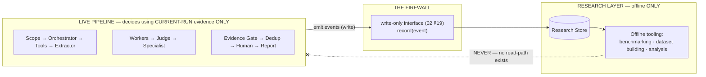

# 10_RESEARCH_DATA_PIPELINE.md
## Hypermind — Track A — Research Data Pipeline

**Document:** STEP 10 of 15 · Track A Documentation Package
**Status:** Authoritative research-data policy and pipeline
**Flagged by the master prompt as:** *CRITICAL*
**Depends on:** `01_ARCHITECTURE.md` §8 (the observation→validated ladder), §13 (research-data flow, observe-only), `02_COMPONENT_SPECS.md` §19 (Research/Audit Store — the store this pipeline writes to and reads from), `03_DATA_SCHEMAS/README.md` §3 (all research-data object schemas — field definitions live there, not here), `09_SECURITY_POLICIES/README.md` §4 (redaction/sanitization policy this pipeline applies)

---

## The One Idea This Document Exists to Protect

**[LOCKED]** `LIVE PIPELINE ≠ RESEARCH MEMORY.`

The research layer **observes and records** the live pipeline. It **must never steer** it. Every rule in this document serves that single separation. Stated as the deepest form of the guarantee (borrowing the framing established in `09` §5): the research layer's safety comes from the **structural absence of any read-path back into live decisions** (`02` §19), not from a rule that says "please don't read it back." A rule can be violated; an absent code path cannot.

This is the concrete defense against the failure mode named repeatedly across this project's history: *one false positive, recycled as if it were validated truth, poisons every future result*. This document is how that never happens.

---

## How to Read This Document

Schema field definitions for every research object (`ResearchEvent`, `FindingRecord`, `CandidateFindingRecord`, `ReplicationRecord`, `ValidationOutcome`, `ExperimentRecord`, `ToolSequenceRecord`, `ModelEvaluationRecord`, `DatasetRecord`, `ModelVersionRecord`) are **already defined in `03` §3** and are not repeated here. This document defines the **pipeline**: what is recorded when, how it's classified, how it's sanitized, how it later becomes useful, and — most importantly — how it is walled off from live operation.

The document is organized to answer, explicitly, the 24 questions the master prompt requires of it. Each is tagged **[Q1]…[Q24]** so coverage is verifiable.

Label legend unchanged — **[LOCKED] [REQ] [REC] [ASSUMPTION] [OPEN — REQUIRES HARSH] [FUTURE] [INFERENCE]**.

---

# §1 — The Contamination Firewall (the core mechanism)

**[LOCKED]** The firewall is not a component that checks permissions — it is the *shape of the interface*. `02` §19 defines the Research Store with a `record()` write method called by live components, and a `query()` read method that "must not be called by any component in Groups 1–4 during live pipeline execution." The firewall is that asymmetry made real: live code physically has no wiring to read research data back.

**[REQ]** This must be verifiable, not merely asserted — `12_ACCEPTANCE_CRITERIA/` will need a test proving no live-pipeline component imports, references, or can reach the Research Store's `query()` path. (Noted forward to `12`; this document states the requirement, `12` operationalizes the test.)

---

# §2 — What Gets Recorded, and When **[Q1, Q2]**

**[Q1 — What gets recorded]:** every security-relevant event and every stage output, as the appropriate `03` §3 research object wrapped in a `ResearchEvent` envelope (`03` §3.1). Concretely: scope decisions, orchestrator authorize/reject events, tool executions, extractions, worker outputs, judge decisions, specialist candidates, evidence-gate results, dedup results, human decisions, and every failure. This is the same event stream that feeds audit logging (`09` §7) — the research layer and the audit layer observe the same events; they differ in *use*, not in *what they see*.

**[Q2 — When it gets recorded]:** **synchronously at the moment each event occurs**, emitted by the component that produced it, via the write-only `record()` interface. Recording happens *as a side effect of the live pipeline running*, never as a later batch reconstruction — with one deliberate exception (§5's `ToolSequenceRecord`, which is *derived offline* from already-recorded events, not emitted live).

**[REQ]** Per `02` §19's failure handling, a recording failure **must not block or alter the live pipeline** — if the Research Store is unavailable, the event is logged locally and reconciled later; the live decision proceeds regardless. This is the one place where the research layer's needs explicitly yield to live operation, and it's correct: an observe-only layer must never be able to stall the thing it observes.

---

# §3 — Classifying Records Along the Evidence Ladder **[Q3, Q4, Q5, Q6]**

Every research record carries the `trust_classification` field (`03` §1.2) — this is what keeps validated and unvalidated data distinguishable forever, even inside the research store. Mapping the four ladder rungs to the records that carry them:

| Ladder rung | **[Q]** | Which records | Source schema |
|---|---|---|---|
| **[Q3] Raw observations** | `RAW_OBSERVATION` | `RawToolOutput`-derived research events | `03` §2.7 |
| **[Q4] Model interpretations** | `MODEL_INTERPRETATION` | `ExtractorJSON`, `WorkerOutput`-derived events | `03` §2.9, §2.12 |
| **[Q5] Candidate findings** | `CANDIDATE_FINDING` | `CandidateFindingRecord` (from `SpecialistPoCOutput`) | `03` §3.3, §2.17 |
| **[Q6] Validated findings** | `VALIDATED_FINDING` | `FindingRecord` (only from a `submit` `ValidationOutcome`) | `03` §3.2, §3.5 |

**[LOCKED]** The rung is not decorative metadata — it is the gate on how a record may later be used (§9). A record's classification is set once, by the stage that produced it, and is never upgraded retroactively except by the single legitimate path: a human `submit` decision producing a `FindingRecord` at `VALIDATED_FINDING` (`03` §1.2). No offline process may "promote" a candidate to validated — only a human, live, can do that.

---

# §4 — Provenance & Version Recording **[Q7, Q8, Q9]**

**[Q7 — provenance preserved]:** every research record embeds the shared `Provenance` common type (`03` §1.1) — `record_id`, `run_id`, `created_at`, `stage`, `source_component`, and conditionally `model_id`/`tool_id`. `run_id` is the join key: every record from one target's run shares it, so a full run can be reconstructed offline from the store without any live state.

**[Q8 — model/version]:** `Provenance.model_id` + `model_version` are **required** on any record produced by a model call (`03` §1.1 validation rule). This is what makes per-model research possible — you can later ask "how did the Judge perform when it was `judge-model-a` v1 versus v2?" only because every judgment carries which model produced it.

**[Q9 — tool/version]:** `Provenance.tool_id` + `tool_version` are **required** on any record produced by a tool execution, mirroring the model rule. Tool versions matter for research reproducibility — a finding produced by Nuclei v3.1 with a specific template set is a different data point than the same nominal finding from a later version.

**[LOCKED]** Per `03` §1.1, exactly one of `model_id`/`tool_id` is set per record (or neither, for deterministic stages like the Evidence Gate) — never both. This keeps provenance unambiguous about what *kind* of thing produced each record.

---

# §5 — Recording Approaches: Sequences, Successes, Failures **[Q10, Q11, Q12]**

**[Q10 — tool sequences]:** the *order* in which tools ran during a run is captured by `ToolSequenceRecord` (`03` §3.7). Crucially, this is **derived offline** from the run's already-recorded `AuditEvent` stream — it is not a live emission. This is deliberate: the sequence is an offline analytical artifact ("which recon orderings tend to lead to candidates"), and deriving it offline keeps zero sequence-analysis logic in the live path. `ToolSequenceRecord.led_to_candidate` is the key research signal — it links a sequence to whether it eventually produced anything.

**[Q11 — successful approaches]:** a "success" at the research level means a chain of records whose `CandidateFindingRecord.eventual_outcome` (`03` §3.3) reached `human_submitted`. The full approach is reconstructable via the `run_id` join and the `full_evidence_trail` preserved on the `FindingRecord` (`03` §3.2). Nothing special is recorded to mark success live — success is *derived* from the outcome field, offline.

**[Q12 — failed approaches]:** failures are first-class research data, not noise to discard. `FailureEvent` (`03` §2.23) captures mechanical failures (timeout, schema-invalid, model-refusal); `CandidateFindingRecord.eventual_outcome` captures analytical failures (`failed_evidence_gate`, `blocked_duplicate`, `human_discarded`). **[INFERENCE]** Recording failures as carefully as successes is what makes the eventual model-improvement work honest — a specialist that produces many `failed_evidence_gate` candidates for a given vuln class is telling you something specific about where that specialist is weak, which you can only learn if failures were preserved with the same provenance rigor as successes.

---

# §6 — False Positives & False Negatives **[Q13, Q14]**

This is the most subtle part of the whole document, because getting it wrong is exactly how the flywheel gets poisoned.

**[Q13 — false positives]:** a false positive is a candidate that *looked* like a finding but a human rejected. It is recorded as: `CandidateFindingRecord.eventual_outcome = human_discarded` (`03` §3.3), plus the `ValidationOutcome.discard_reason` (`03` §3.5, which is **required** on a discard precisely so this signal isn't lost). **[LOCKED]** A false positive retains `trust_classification: CANDIDATE_FINDING` forever — it is *never* relabeled toward validated, and it is **never** eligible to become a few-shot example (§9 forbids this structurally). A false positive is valuable *as a labeled negative* for research, and dangerous *only if it's ever mistaken for a positive* — the classification field is what prevents that mistake permanently.

**[Q14 — false negatives (recorded later)]:** a false negative is harder — it's a real vulnerability the pipeline *missed* or *dropped*, which by definition the pipeline didn't flag at the time. It can only be recorded **retroactively**, when external ground truth arrives (e.g. the target discloses a vuln the pipeline saw evidence of but dropped, or a human later realizes a dropped candidate was real). **[REC]** The mechanism: a retroactive research annotation linking the newly-known-real vulnerability back to the `run_id` and the specific `drop`/`needs_more_evidence` decision that missed it — recorded as a new research event, never by editing the original decision record (which must remain an accurate record of what was decided *at the time*, with the information available *at the time*). **[OPEN — REQUIRES HARSH] OD-25:** the concrete schema/mechanism for retroactive false-negative annotation isn't defined in `03` §3 — it's referenced as possible ("How false negatives can later be recorded") but no dedicated record type exists for it. Whether to add one, or to represent it as a specially-typed `ResearchEvent`, is an open design question.

**[LOCKED]** Neither false positives nor false negatives are ever *deleted*. Both are the highest-value research data the system produces — they are precisely where the models are wrong, which is precisely what future improvement targets.

---

# §7 — Human Validation Representation **[Q15]**

**[Q15]:** human validation is represented by `ValidationOutcome` (`03` §3.5), carrying `decision` (`submit`/`discard`/`needs_more_evidence`), `human_identity`, `decided_at`, and a required `discard_reason` on discards. This record is dual-purpose (`03` §2.28 note): it drives the live pipeline (SUBMIT → Report Polisher) *and* it is written to the research store. It is the **only** record type whose creation can produce a `VALIDATED_FINDING` classification downstream — the single legitimate path up the ladder's top rung (§3, `03` §1.2). This makes human validation the literal, structural definition of "ground truth" in Track A: not a confidence score, not a gate pass, but a named human's recorded `submit` decision.

---

# §8 — Sanitization **[Q16]**

**[Q16]:** research records are sanitized under the authority of `09` §4 (the redaction policy) — this document does not define a second, competing sanitization policy; it *applies* `09` §4 to the research context. Specifically:
- Credential-class data (`09` §4) is never stored in a research record, exactly as it's never logged — no research exception.
- Sensitive-but-not-credential data (incidental third-party user data in evidence) is stored as *minimal sufficient evidence* (`09` §4's resolution), not full dumps — this matters *more* for research records than for transient logs, because research records are *retained long-term by design* (that's their whole purpose), so any over-collection compounds over time.
- Provenance is never redacted (`09` §4) — it's the research backbone.

**[INFERENCE]** There's a real consequence here worth naming: because research records persist indefinitely while serving the flywheel, the research store is the single largest long-term accumulation of potentially-sensitive data in all of Track A. This makes OD-24 (log retention/encryption, from `09` §7) apply with *extra* force to the research store specifically — arguably the research store needs its *own* explicit retention and encryption-at-rest decision, distinct from transient audit logs. Flagged as part of OD-24's scope rather than a new number, since it's the same underlying question applied to a higher-stakes store.

---

# §9 — How Data Becomes Useful (and How It Must Not Be Used) **[Q17–Q22]**

This section is the research layer's *entire reason to exist* — and every use below is **offline only**, reading from the store across the firewall (§1), never feeding a live decision.

**[Q17 — evaluation data]:** validated `FindingRecord`s (and labeled false positives) become evaluation datasets (`DatasetRecord`, `03` §3.9) — a curated set with known-correct labels against which a model's output can be scored. **[LOCKED]** An evaluation dataset may contain only records whose provenance and classification are verified — `DatasetRecord.purity_notes` (`03` §3.9) exists specifically to document this, directly serving the anti-contamination discipline.

**[Q18 — few-shot learning (future)]:** **[FUTURE]** validated findings can later become few-shot examples injected into a Skill's `few_shot_examples` (`05` §"Skill Registry"). **[LOCKED]** *Only* `VALIDATED_FINDING`-classified records are eligible — this is the structural rule `05` already anticipated by keeping all four Skills' `few_shot_examples` empty until real validated data exists. A `CANDIDATE_FINDING` (including any false positive) is *permanently ineligible* to become a few-shot example. This is the single most important anti-poisoning rule in the document: the classification field, set once and never upgraded except by human validation, is what makes "few-shot examples can only be real findings" enforceable rather than merely intended.

**[Q19 — LoRA/fine-tuning (future)]:** **[FUTURE, GATED]** per `01`/`02`'s repeated discipline, fine-tuning is a *late* option, gated behind a large enough clean validated dataset *and* a demonstrated repeated specialist weakness (visible only because §6 recorded failures rigorously). `ModelVersionRecord` (`03` §3.10) enforces the data-lineage rule: a fine-tuned model's `training_data_reference` must point to a `DatasetRecord`, never to unvalidated candidates. **[LOCKED]** The consensus this project has held throughout applies: RAG/few-shot over the validated corpus should be exhausted *before* fine-tuning is attempted — fine-tuning is the last resort, not the default endpoint of the flywheel.

**[Q20 — specialist benchmarking (future/ongoing)]:** `ExperimentRecord` (`03` §3.6) → `ModelEvaluationRecord` (`03` §3.8) is the benchmarking loop that populates `08_MODEL_REGISTRY/`'s currently-null `evaluation_dataset`/`evaluation_metrics` fields. This is how the "candidate_untested" models in `08` eventually earn a `primary` status — through recorded, dataset-backed evaluation, not through anyone's preference (`08` §"WHAT YOU SHOULD UNDERSTAND" point 2).

**[Q21 — chaining research (far future):]** **[FUTURE — this is the Darwin groundwork, and nothing more than groundwork]** `ReplicationRecord` (`03` §3.4) preserves validated vulnerability *primitives* — individual confirmed findings with their reproduction steps — as independently queryable records. This is *exactly and only* the data-structure prerequisite `01` §21's Darwin boundary described: the MVP records validated primitives cleanly so that *if* chaining research is ever pursued, the input corpus exists. **[LOCKED]** This document defines no chaining mechanism, no fitness function, no evolutionary loop — it defines only that validated primitives are preserved in a form that would make such research *possible later*. Building anything beyond that preservation is explicitly out of scope (`01` §21).

**[Q22 — how data must NOT be used]:** **[LOCKED]** The prohibitions, consolidated:
1. **Never** read into a live pipeline decision (the firewall, §1).
2. **Never** let a `CANDIDATE_FINDING` (or any unvalidated record) become a few-shot example or training datum (§9 Q18/Q19).
3. **Never** promote a record's classification offline — only human validation, live, moves a record to `VALIDATED_FINDING` (§3).
4. **Never** delete false positives/negatives (§6) — they are the highest-value research data.
5. **Never** treat historical findings as *current* evidence — a prior run's finding does not authorize or pre-judge a current run (`01` NG3, the Mem0 boundary).

---

# §10 — What Must Never Be Treated as Ground Truth **[Q23]**

**[Q23]:** **[LOCKED]** The following are *never* ground truth, no matter how confident they appear:
- An LLM-generated claim (any `MODEL_INTERPRETATION` or `CANDIDATE_FINDING` record).
- A Judge decision (`JudgeRoutingDecision`, however high its `confidence` field).
- A Specialist's PoC (`SpecialistPoCOutput`, however high its `specialist_confidence`).
- A tool's successful-looking output (`RAW_OBSERVATION` — a tool "matching" is not a confirmed vulnerability).
- An Evidence Gate pass (a candidate that passed the gate is *review-ready*, not *validated*).

**Ground truth is exactly one thing:** a record whose `trust_classification` is `VALIDATED_FINDING`, which exists only because a named human recorded a `submit` decision (§7). Every confidence score anywhere in the system (`03` §2.14, §2.17) exists for research and logging — *never* as a substitute for human validation. This is "evidence over confidence" (`01` §4) stated as a data-truth rule.

---

# §11 — Dataset Versioning **[Q24]**

**[Q24]:** `DatasetRecord` (`03` §3.9) carries a `version` field, but `03` deliberately left the *versioning policy* to this document (`03` §3.9 note: "versioning policy... is `10`'s decision").

**[REC]** Recommended policy: datasets are **immutable once versioned**. A change (adding newly-validated findings, removing a record found to be contaminated) produces a *new* version with a new `dataset_id`+`version`, never an in-place edit. Rationale: any `ExperimentRecord` or `ModelEvaluationRecord` that referenced version N must remain reproducible — if version N could be edited underneath it, past benchmark results would become unverifiable. This mirrors §6's "never edit an original decision record" principle and §1's immutability instincts throughout.

**[REC]** Version identifier: a monotonic scheme that makes ordering obvious (semantic `vN` or an ISO date, per `03` §3.9's example) — the specific choice matters less than the immutability guarantee above.

**[OPEN — REQUIRES HARSH] OD-26.** Dataset *pruning* policy: when a record is later discovered to be contaminated (e.g. a "validated" finding turns out to have been a human error), how is it handled across all dataset versions that already included it? Options: (a) leave old versions as-is with a contamination annotation and exclude from new versions only, or (b) issue corrected versions of every affected dataset. Option (a) preserves reproducibility but keeps known-bad data in old versions; option (b) is cleaner but breaks reproducibility of past experiments. This is a genuine trade-off with no obviously-correct answer, worth Harsh's explicit decision rather than a default.

---

## Coverage Check — All 24 Required Questions

| Q | Topic | § |
|---|---|---|
| Q1 | What gets recorded | §2 |
| Q2 | When recorded | §2 |
| Q3 | Raw observations | §3 |
| Q4 | Model interpretations | §3 |
| Q5 | Candidate findings | §3 |
| Q6 | Validated findings | §3 |
| Q7 | Provenance preserved | §4 |
| Q8 | Model/version | §4 |
| Q9 | Tool version | §4 |
| Q10 | Tool sequences | §5 |
| Q11 | Successful approaches | §5 |
| Q12 | Failed approaches | §5 |
| Q13 | False positives | §6 |
| Q14 | False negatives (later) | §6 |
| Q15 | Human validation representation | §7 |
| Q16 | Sanitization | §8 |
| Q17 | Becomes evaluation data | §9 |
| Q18 | Supports few-shot (future) | §9 |
| Q19 | Supports LoRA/fine-tuning (future) | §9 |
| Q20 | Supports benchmarking | §9 |
| Q21 | Supports chaining research (future) | §9 |
| Q22 | How data must NOT be used | §9 |
| Q23 | Never ground truth | §10 |
| Q24 | Dataset versioning | §11 |

All 24 covered.

---

## New Open Decisions Raised in This Document

| ID | Question | Raised in |
|---|---|---|
| **OD-25** | No dedicated schema/mechanism exists in `03` §3 for retroactive false-negative annotation — add a record type, or represent as a specially-typed `ResearchEvent`? | §6 (Q14) |
| **OD-26** | Dataset pruning policy when a record is later found contaminated — annotate-and-exclude-going-forward (preserves reproducibility, keeps known-bad in old versions) vs. reissue corrected versions (clean, breaks past reproducibility)? | §11 (Q24) |

**Advanced (not new): OD-24** (`09` §7 retention/encryption) — §8 establishes it applies with extra force to the research store specifically, which is the largest long-term sensitive-data accumulation in Track A. Worth treating the research store's retention/encryption as an explicit sub-decision of OD-24.

Carried forward with OD-01 through OD-24 into `13_OPEN_DECISIONS.md`. Running total: **26 open decisions.**

---

## WHAT YOU SHOULD UNDERSTAND BEFORE NEXT

Before `11_TEST_PLAN/`, these concepts matter most:

1. **The firewall is an interface shape, not a guard.** The single most important thing to carry forward: the research layer is safe because live code *cannot reach* its read-path, not because a rule forbids reading it. `11_TEST_PLAN/` needs a test that proves this structurally (no live component can even import/call `query()`), which is a different and stronger kind of test than "verify the rule is followed." Absence is testable by attempting the forbidden thing and confirming it's impossible, not merely unobserved.

2. **`trust_classification`, set once and never upgraded offline, is the entire anti-poisoning mechanism.** Everything in §6 and §9 reduces to this one field's discipline: a candidate stays a candidate forever unless a *human*, *live*, validates it. If you remember one implementation invariant from this document, make it this — and it's exactly what `12`'s acceptance criteria will test ("validated and unvalidated records remain distinguishable").

3. **Failures and false positives are assets, not garbage.** The instinct to discard "the runs that didn't work" would quietly destroy the most valuable research data the system produces — the labeled record of exactly where the models are wrong. §6's "never delete" rule is counterintuitive but correct: model improvement targets weaknesses, and weaknesses are only visible if failures were preserved with full provenance.

4. **Everything future (few-shot, LoRA, chaining/Darwin) is groundwork here, not implementation.** This document defines how to *record data in a form that would make those possible*, and nothing more. Resist reading §9's Q18/Q19/Q21 as "and then we build Darwin" — they are "and we made sure that if that's ever built, the clean input corpus exists." The discipline that kept Darwin out of the MVP (`01` §21) is fully preserved here.

5. **The research store is Track A's biggest long-term data-sensitivity liability, precisely because retention is its purpose.** Transient logs age out; research data is kept on purpose, forever, to serve the flywheel. That makes §8's sanitization and OD-24/OD-26's retention decisions matter *more* for this store than anywhere else in the system. A clean flywheel and a responsibly-managed data store are the same problem viewed from two angles — both come down to rigorous classification and minimal sufficient collection.
